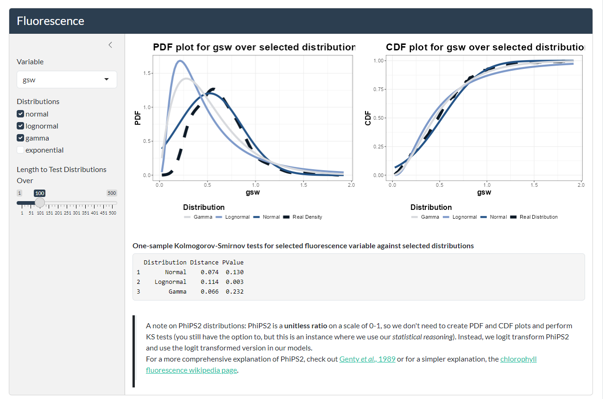
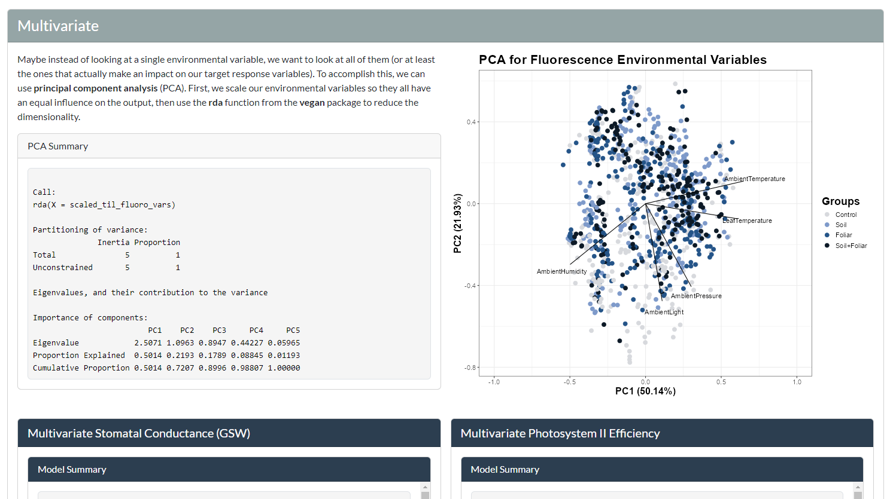

# Tomato Inoculant App

 An app that goes along with my graduate thesis examining the effects of novel inoculation methods on tomato plants.

## Links
 Accessible via link or QR Code below. Viewing on a laptop or PC is recommended over mobile phone.

 | Link | QR Code |
 | ---- | ------- |
 |https://zachpeagler.github.io/tomato-inoculant-app/| 

 > If you get a blank screen on app startup, wait ~15 seconds and see if it loads. Shinylive apps can take a long time to initialize, especially apps as sprawling as this.

## Screenshots

## About the App
Built in R 4.4.3 using the shiny, ggplot2, stringr, scico, bslib, bsicons, multcomp, MASS, car, MuMIn, lmerTest, and vegan packages. The app is built with shinylive to render it as a static website and automatically deployed to github pages with github actions. Shinylive deployment to github pages, while slower than if the app were hosted on AWS or Azure, eliminates any hosting costs, as all the computing occurs within the users web browser. To learn more about shinylive, visit the [shinylive github repository](https://github.com/posit-dev/r-shinylive/).

## License
 This project is licensed under the MIT License. See the [LICENSE](LICENSE) for more details.
## Contributing
 If you would like to contribute, create a push request into the test branch!
## Bug Reporting
 Please report bugs at https://github.com/zachpeagler/tomato-inoculant-app/issues.
